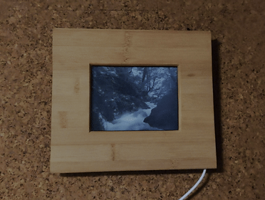
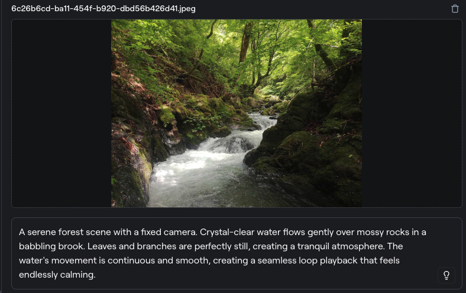

# Kindle picture frame
 
This repo is for picture frame on kindle 3 and Paperwhite 1.

## Screenshots

&nbsp;


## Requirements

- [Jailbroken Kindle](https://wiki.mobileread.com/wiki/Kindle_Hacks_Information)

Each model and firmware version requires different type of jailbreak. 
See tutorial at MobileRead forum.

- [MobileRead forum](https://www.mobileread.com/forums/forumdisplay.php?f=150##)

1. When kindle Jailbrake was successful, install kterm and set root password.
2. Install KUAL and MobileRead Package Installer.
3. Install usbnet.
4. Start sshd daemon (dropbear or openssh)
5. Access to kindle via usbnet or wifi, start setup this program.


### 1. Install the program

`(github)/kindle_stuff/kindle-tcc.1.5.tar.gz` to `(kindle)/mnt/us/tcc`.

execute `./install`

build `tccmake gmplay-pw1` or  `tccmake gmplay-k3`


### 2. Get video source

convert an image to a video powered by AI.

- [Gen-3](https://app.runwayml.com/)

&nbsp;


### 3. Create video and play

a) Crop video

```
ffmpeg -i Gen-2\ xxxxxxx,\ A\ serene\ forest\ scen,\ IMG_xxxxxxxx.mp4 -vf "crop=900:765:50:50" video.mp4
```

b) Extract images

```
ffmpeg -i video.mp4 -vf fps=3 frame%02d.png
```

c) Create a mask image(transparent image) and a masked video

PW1:

```
ffmpeg -i video.mp4 -i mask.png \
-filter_complex "[0:v][1:v] overlay=0:0" -c:a copy \
-pix_fmt gray \
-s 1024x768 output_pw1.mp4
```

K3:

```
ffmpeg -i video.mp4 -i mask.png \
-filter_complex "[0:v][1:v] overlay=0:0" -c:a copy \
-pix_fmt gray \
-s 800x600 output_k3.mp4
```


d) Build converter

PW1:

```
gcc raw2gmv_pw1.c -o raw2gmv_pw1
```

K3:

```
gcc raw2gmv_k3.c -o raw2gmv_k3
```


e) Create rawformat video

PW1:

```
ffmpeg -i output_pw1.mp4  -pix_fmt gray -f rawvideo out_pw1.raw
```

K3:

```
ffmpeg -i output_k3.mp4  -pix_fmt gray -f rawvideo out_k3.raw
```

f) Convert from rawvideo to gmv

PW1:

```
cat out_pw1.raw | ./raw2gmv_pw1 > video_pw1.gmv
```

K3:

```
cat out_k3.raw | ./raw2gmv_k3 > video_k3.gmv
```

g) Compress video

PW1:

```
gzip video_pw1.gmv
```

K3:

```
gzip video_k3.gmv
```

h) Copy a video file to kindle and play it.

PW1:

```
eips -c -f
while true; do
   zcat ./video_pw1.gmv.gz | ./gmplay-pw1
done
```

K3:

```
eips -c -f
while true; do
   zcat ./video_k3.gmv.gz | ./gmplay-k3
done
```

i) shell script

start:

```
cd /mnt/us/kindle-picture-frame; ./run_pw1.sh ./video_pw1.gmv.gz
```

stop:

```
kill `cat /tmp/kindle-picture-frame.pid`
```

### 4. Disable sleep mode on PW1

Enter `~ds` in the search field.


# Credits

- [tcc](https://www.mobileread.com/forums/showthread.php?t=175834)
- [gmplay](https://www.mobileread.com/forums/showthread.php?t=177455&highlight=gmplayer)

 